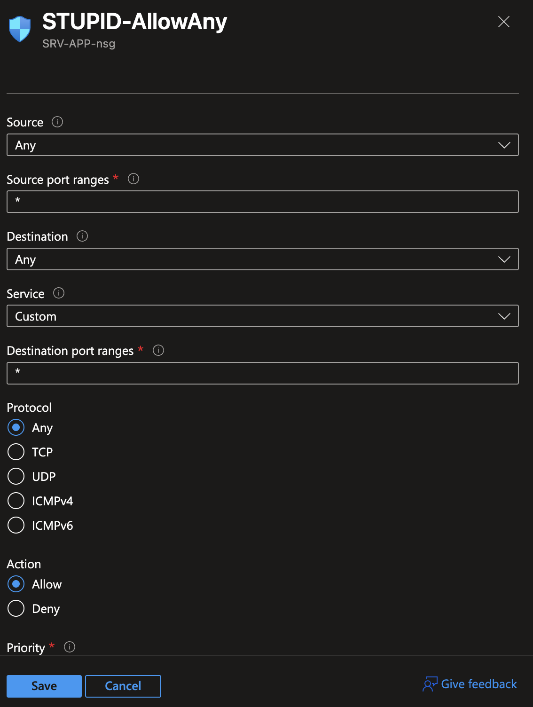

This page contains all the steps to set up the infrastructure as well as monitoring and detection. I decided to keep it brief since setting these up is pretty straightforward and no one is reading this.
# 1. Infrastructure

## 1.1 VM and VNet
I started by setting up a Virtual Machine and Virtual Network in my closest region.

I chose the Standard D2s v5 (2 vcpus, 8 GiB memory) which is probably overkill but Azure trial has $200 credit so who cares, and gave it the attractive name "SRV-APP".

I then connected to the machine using RDP and removed all the windows firewall controls: domain profile, private profile, public profile -> OFF.

By this point, I could already see a few failed logins in the Windows Event Viewer of the machine.

## 1.2 NSG
I then modified the Network Security Group by adding an 'allow any' rule at the top of the list, allowing all traffic on all ports:

(Priority=100)

# 2. Monitoring and Detection
I created a Log Analytics Workspace and added Sentinel to it.

I then needed to connect the VM to the LAW using the Azure Monitoring Agent. I downloaded this from the content hub under Windows Security Events in Sentinel.

Finally, in the monitoring agent, I created a data collection rule to detect all security events for the VM.

By the end of this page, my resource group contained:
- VM
- DISK
- VNet
- Public IP address
- Network Interface
- NSG
- LAW
- DCR
- Automatic Azure resource add-ons (e.g. Application Insights or API connections)