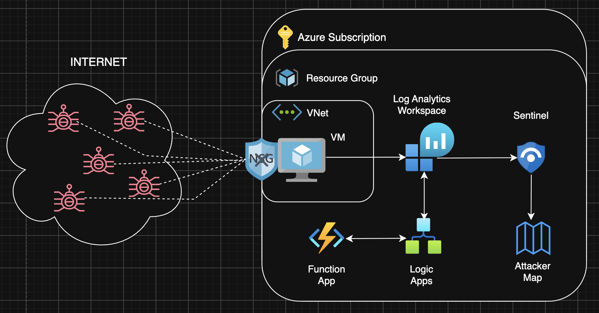
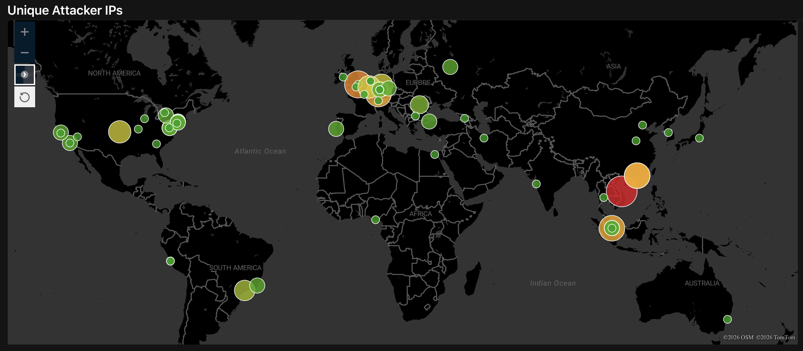
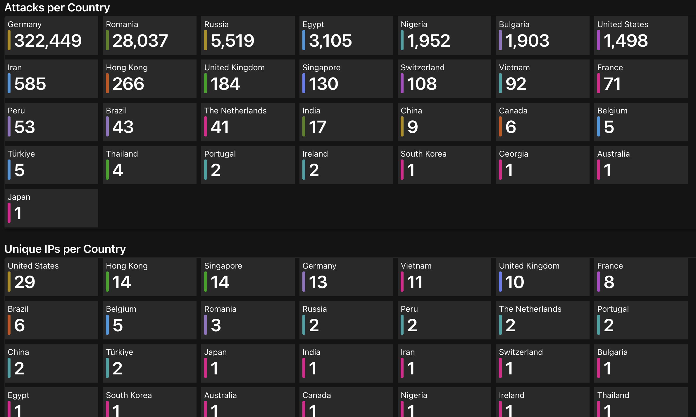
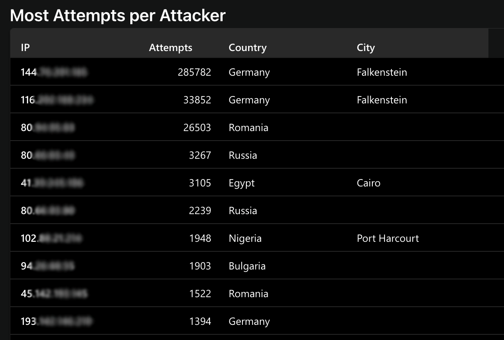
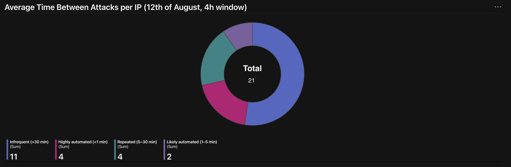

# 1. Introduction
This page goes over the motivation, logic, and results of the project, as well as basic reasoning about how I decided to implement IP Geolocation functionality.

*Infrastructure, Monitoring and Detection.md* contains the necessary infrastructure and basic configurations for monitoring and detection elements.

*Automation and Visualisation.md* contains configurations and important code for automation and visualisation elements.

## 1.1 Motivation
This is a personal project intended to sharpen my skills with Azure and Sentinel, through building a honeypot used as a basic SOC monitoring and detection lab. 

The goal was to spin up a Virtual Machine, remove the firewall security controls, and expose it to the Internet for the world to attack. Using the telemetry logged from authentication attempts, I would log the IPs of the attackers and trace their locations using an IP Geolocation system. Finally, I wanted to create a dashboard with stats and a heat map to mimic a real SOC environment, cuz it looks cool.

The project was heavily inspired by a cybersecurity youtuber's tutorial, where he does a great job explaining how to setup up the initial infrastructure. I later found that his implementation of IP Geolocation was very poor (no disrespect), so I decided to try a different approach and design a more accurate and automated version using Azure apps.

## 1.2 IP Geolocation
At first, I tried using a .csv file in Sentinel Watchlist like in the tutorial but found that it was very inaccurate when cross-checking with MaxMind, a reputable online database. I decided to use that to locate attackers as it was much larger and more accurate.

These are two files are from MaxMind, GeoLite2Blocks and GeoLite2Locations. I wrote Python code to try to combine them into a master file and reduce the size by removing unnecessary columns. In hindsight this was hilariously naive, as the max size for Watchlist files is 3.8MB and mine was 200MB. I then thought about using MaxMind's API but didn't want to limit myself to the daily request limits and slower speeds.

I finally settled on using their .mmdb file which is much smaller (60MB) and supports binary-search tree lookup which is super fast. To do this, I set up a Function App and a Logic App to send me the enriched IP data (*Automation and Visualisation.md*).

# 2. Logic

I just realised that I could've used Event Grid to trigger the Logic App automatically when I run the VM but it's 12am and no one's reading this.

Here, the Network Security Group uses an 'allow any' rule to allow all traffic on all ports into the VNet. This makes it completely useless, which is the whole point.
The VM sends telemetry to Log Analytics Workspace about unauthorised authentication attempts made to the VM, logging attacker IPs under the SecurityEvent table (EventID=4625). The attacker IPs are then extracted by Logic Apps, which uses a Function App to enrich the IPs with geolocation data, and are sent back to the LAW under a custom table.
Finally, this tabled is queried through Sentinel and visualised using Workbooks, where maps, grids, tiles etc. can be configured.

# 3. Results
The honeypot successfully logged failed attempts in the SecurityEvent table under EventID=4625. The IPs were then correctly enriched using MaxMInd's database and the results were visualised in a Sentinel Workbook. The following are a few visualisations I thought would be interesting to look at.

## 3.1 Heat Map

When zoomed out like this, some of the dots appear to be stacked on the same location but they are actually unique longitudes and latitudes (e.g. Singapore).
## 3.2 Attacks per Country & Unique IPs per Country

\+ Georgia =  1 IP

## 3.3 Most Attempts per Attacker

Blurred for obvious reasons (i'm a chill guy)

## 3.4 Average Time between Attacks per IP

Data taken from the 12th of August, from 13:00-17:00.

## 3.4 Conclusion and Ways Forward
It's important to note that IP here represents the location of the observed network address and not necessarily the physical location of the attacker, so take everything with a grain of salt.

After leaving the VM running for a couple days, the top three sources of unique attacker IPs were the United States, Hong Kong, and Singapore, with the majority of the remaining countries located in Europe. This distribution could reflect the high concentration of cloud and hosting infrastructure in these regions, since VPNs, VPSs, proxies, and cloud infrastructure can affect IP location.

It's also interesting to see that the large majority of the attacks themselves are committed by the same IPs, which indicates a high chance of automated activity and the use of a bot or scanning tools.

When looking at the pie chart for the average time between attacks per IP, we can see that around 29% of the repeat attackers made attempts less than five minutes apart, which is a strong sign of automated behaviour. Another 19% showed repeated activity within 30 minutes. However, half of the repeat attackers were classified as infrequent so we can't assume that every attacker was a bot or that infrequent activity came from real people.
Overall, the results suggest that automated behaviour was present in the honeypot, but not all observed attackers showed signs of automation.

The most interesting way forward for me would be to configure detection and incident creation in Sentinel to detect repeated logins in a short time frame (e.g. 20 attempts in 15 minutes -> brute force). I could then add a severity level  based on how many attempts were made and generate a daily report, getting even closer to a real SOC environment.
